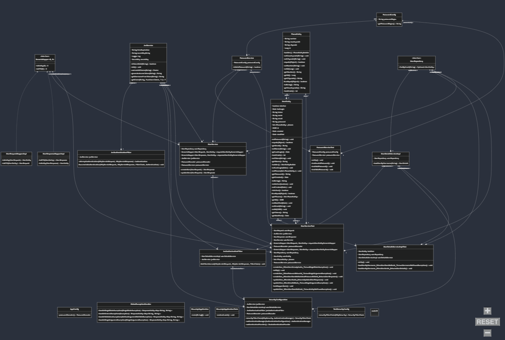

# Nisum API

Este es un proyecto de API RESTful desarrollado para manejar usuarios en una aplicación utilizando validaciones de contraseña, mapeo de entidades y manejo de excepciones globales. Incluye pruebas unitarias y de integración.

## Requisitos Previos

- Java 17
- Maven 3.8+
- IntelliJ IDEA (opcional pero recomendado)

## Tecnologías Utilizadas

- Spring Boot 3.x
- Spring Data JPA
- Spring Security
- Spring Validation
- Lombok
- JUnit 5
- Mockito
- H2 (base de datos en memoria para pruebas)

## Configuración del Proyecto

### 1. Clonar el Repositorio

**HTTPS**
```bash
git clone https://github.com/J0hann48/nisum-latam-api.git
cd nisum-api
```
**SSH**
```bash
git clone git@github.com:J0hann48/nisum-latam-api.git
cd nisum-api
```
### 2. Configurar el Entorno

Verifica que tengas Java 17 configurado. Puedes verificarlo ejecutando:

```bash
java -version
```

### 3. Compilar el Proyecto

Para compilar el proyecto, ejecuta el siguiente comando:

```bash
mvn clean install
```
## Ejecutar la Aplicación

### Pasar Parámetros como Argumentos de Línea de Comandos

```bash
java -jar target/nisum-api-0.0.1-SNAPSHOT.jar --spring.datasource.username=tu_usuario --spring.datasource.password=tu_contraseña --password.regex=regex_personalizado
```

## Instrucciones para Probar la Aplicación

### 1. Ejecutar el Script de Base de Datos

Ejecuta el script `export.sql` que se encuentra en la raíz del proyecto para configurar la base de datos H2. Este script contiene las instrucciones necesarias para inicializar la base de datos.

### 2. Importar la Colección de Postman

Usa Postman para importar el archivo `Nisum-api.postman_collection.json`, el
cual se encuentra en la raíz del proyecto. Esta colección contiene las 
solicitudes necesarias para probar la API.

### 3. Probar la Aplicación

#### 1. Probar Creación de Usuario

Para crear un usuario, envía una solicitud `POST` al endpoint `/v1/user/create` con el siguiente cuerpo JSON:

Es importante tener en cuenta que la contraseña se registre teniendo en cuenta las siguientes condiciones

- Al menos una letra minúscula.
- Al menos una letra mayúscula.
- Al menos un dígito. 
- Al menos un carácter especial (@$!%*?&).
- Longitud mínima de 8 caracteres.

```json
{
  "name": "Test User",
  "email": "test@example.com",
  "password": "ValidPassword123!",
  "phones": [
    {
      "number": "123456789",
      "citycode": "1",
      "countrycode": "57"
    }
  ]
}
```
### Respuesta Esperada:

**201** Created si el usuario se crea correctamente.

**400** Bad Request si la contraseña no es válida.

## 2\. Probar Validaciones de Contraseña

Si la contraseña no cumple con el formato esperado, recibirás una respuesta con estado 400 Bad Request y un mensaje de error adecuado.

Ejemplo de respuesta:

```json
{
"mensaje": "La contraseña no cumple con el formato requerido"
}
```

## 3\. Probar Edición de Usuario

Para editar un usuario existente, envía una solicitud PUT al endpoint /v1/user/edit con el siguiente cuerpo JSON:

```json

{
  "name": "Updated User",
  "email": "test@example.com",
  "phones": [
              {
                "number": "987654321", 
                "citycode": "2", 
                "countrycode": "57"
              }
            ]
}
```
### Documentacion Swagger

Para ver la documentacion de Swagger luego de ejecutar la aplicacion se debe ir al siguiente endpoint
```
/swagger-ui.html
```

### Consideraciones para la Edición:

- El campo email debe ser el mismo que el del usuario existente que deseas editar.

- Si el usuario no existe, recibirás un estado 404 Not Found.

- Si los datos son válidos, recibirás una respuesta 200 OK con los detalles actualizados del usuario.

### Respuesta Esperada:

**200** OK si el usuario se edita correctamente.

**400** Bad Request si hay algún problema con los datos enviados.

## 4\. Consideraciones sobre la Autenticación

La API utiliza autenticación basada en tokens JWT. Para acceder a los endpoints protegidos (como la edición de usuarios), debes incluir un token JWT válido en el encabezado de la solicitud.

### Pasos para Obtener un Token JWT:

- Crea un usuario utilizando el endpoint de creación de usuario.

- Crea un usuario para recibir un token JWT válido.

- Incluye el token en el encabezado de la solicitud de la siguiente manera:

```makefile
Authorization: Bearer <tu\_token\_jwt>
```